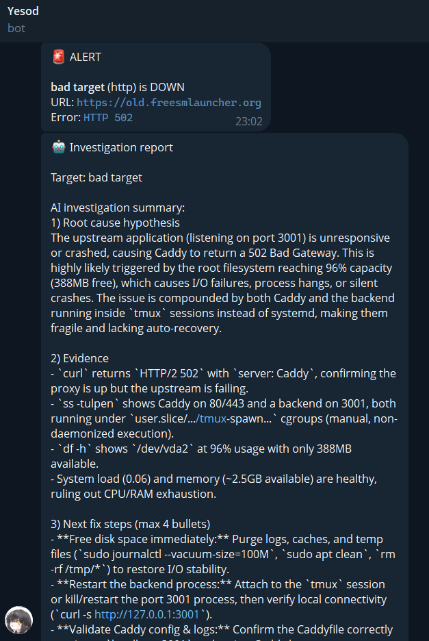
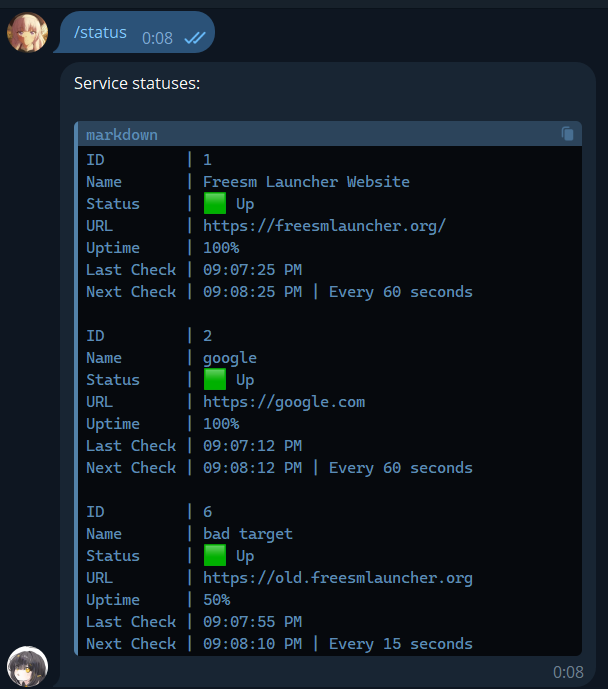
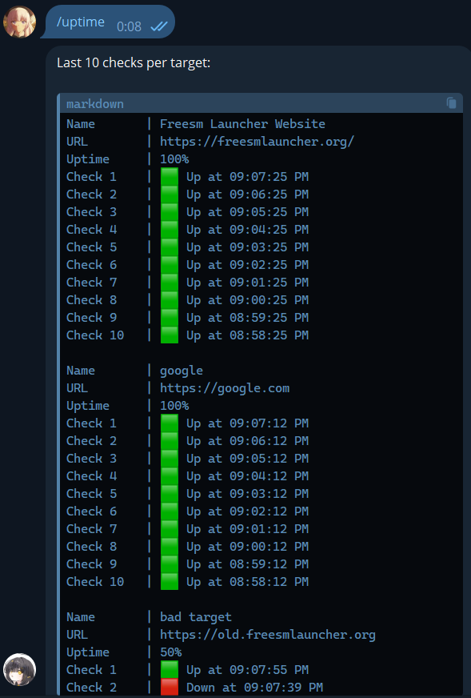
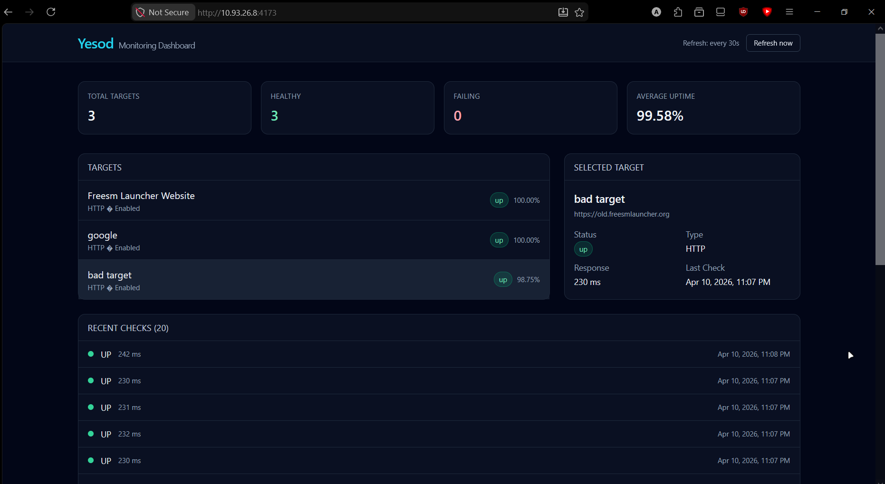

<div align="center">


<h1>Yesod</h1>

An AI-driven monitoring service for multiple Virtual Dedicated Servers (VDS) with a Telegram bot and a web dashboard.
</div>

## Demo






## Product context

### End users

Me, homelab enthusiasts, developers, and regular users who host services on Virtual Machines (VM)

### Problem

Managing several VDS at once is time-consuming. Besides, when one service fails, you cannot easily know it unless people notify you. Additionally, the failure of a service requires one to investigate the problem and fix it, yet they often cannot do it in time.

Of course, projects like [Prometheus](https://prometheus.io/) exist, which fulfill the gap of monitoring services. However, such projects cannot handle fixing simple issues; they are only useful for detecting the problems.

### Solution

This project will monitor the health of services via scheduled checks. It will be able to manage multiple VMs at once. Moreover, it will try to SSH into the failing VM and fix the problems via a LLM.

## Features

- A scheduled job that checks whether the server and its services are responding.
- A Telegram bot that can notify both the admin user and a Telegram group chat when any service is down.
- An incident investigator that SSH-es into the VM, gathers diagnostics, and asks AI for a root-cause summary.
- That Telegram bot will also be able to show simple metrics and data (e.g., uptime).
- A web dashboard that graphically represents the data.

## Usage

- Send a message with the command `/start` in the [Telegram Bot](https://t.me/firefox_chan_bot#)
  - You can add targets there
  - In group chats, bot commands are restricted to Telegram admins
- Visit the [Web Dashboard](http://10.93.26.8:4173/)
- For LLM investigations, add the SSH public key of the host VM to the target VM (in `authorized_keys`). Make sure to make a user for the host VM as well
  - The SSH private key must be specified in `INVESTIGATOR_SSH_KEY_PATH` of `.env.secret`
  - Note that LLM investigations take up some time (around 2 minutes). They are triggered after the first target down event

## Deployment

> For Ubuntu 24.04

Clone the repository

```bash
git clone https://github.com/notwindstone/se-toolkit-hackathon
cd se-toolkit-hackathon
```

Create `.env.secret` with the contents from `.env.secret.example`, and then fill the values (or replace them):

```env
# Telegram
TELEGRAM_BOT_TOKEN=
ADMIN_USER_ID=1511972077
NOTIFICATION_CHAT_ID=-1001234567890
# Legacy fallback (optional): if ADMIN_USER_ID is unset, ADMIN_CHAT_ID is used instead
# ADMIN_CHAT_ID=1511972077

# Qwen API
QWEN_API_KEY=my-secret-qwen-key
QWEN_API_BASE_URL=http://10.93.26.8:42005/v1
QWEN_MODEL=coder-model

# AI investigator over SSH
INVESTIGATOR_ENABLED=true
INVESTIGATOR_SSH_USER=windstone
INVESTIGATOR_SSH_HOST=
INVESTIGATOR_SSH_PORT=22
INVESTIGATOR_SSH_KEY_PATH=~/.ssh/id_rsa
INVESTIGATOR_COOLDOWN_SECONDS=900
INVESTIGATOR_COMMAND_TIMEOUT_MS=20000

# Server
PORT=3000

# Database
DATABASE_PATH=/data/chesed.db
```

Build and run

```bash
docker compose --env-file .env.secret up --build -d
```

Now, access these services via your telegram bot, the web dashboard (port 4173 of the host IP), or an API (port 3000 of the host IP).

> [!WARNING]
> Although I briefly overviewed the code, the entire project was vibe-coded
